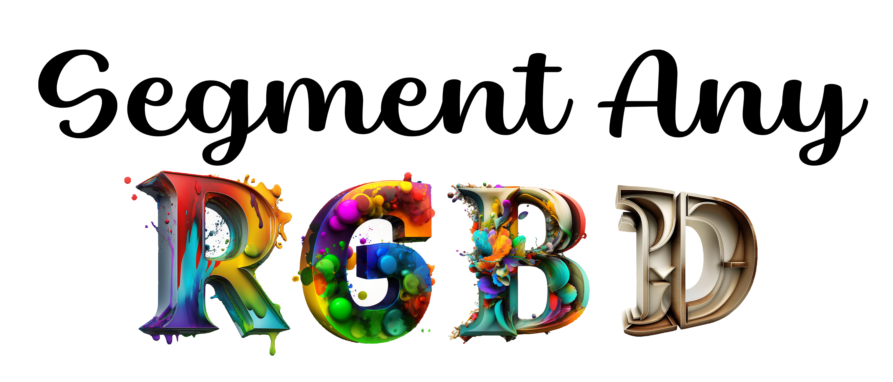
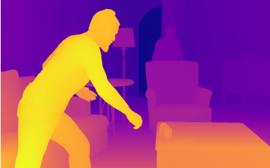
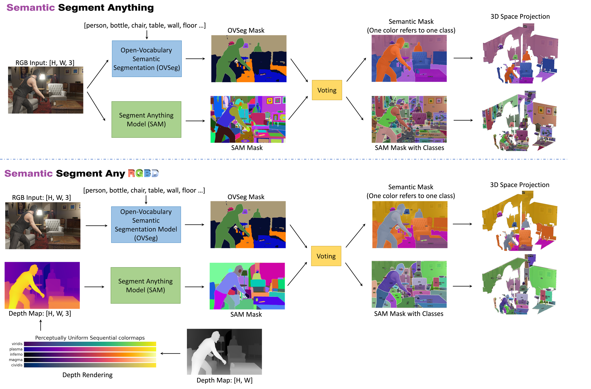
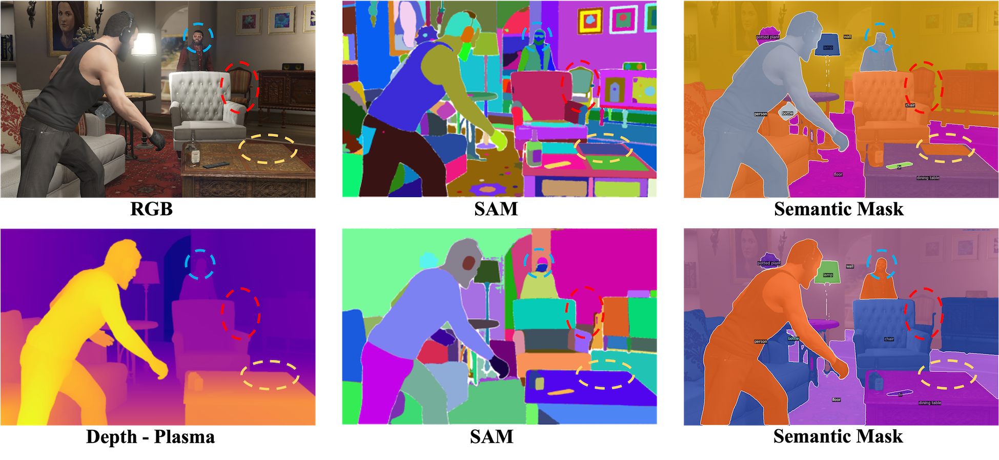
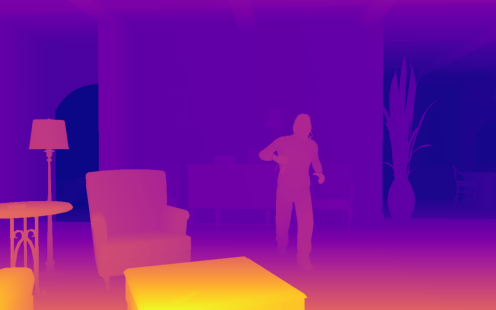
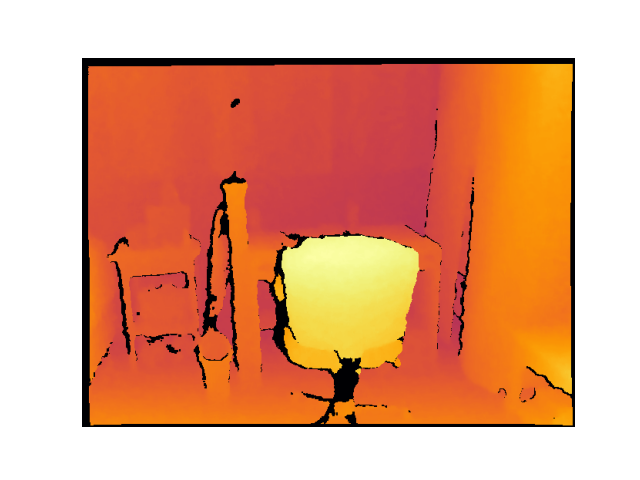
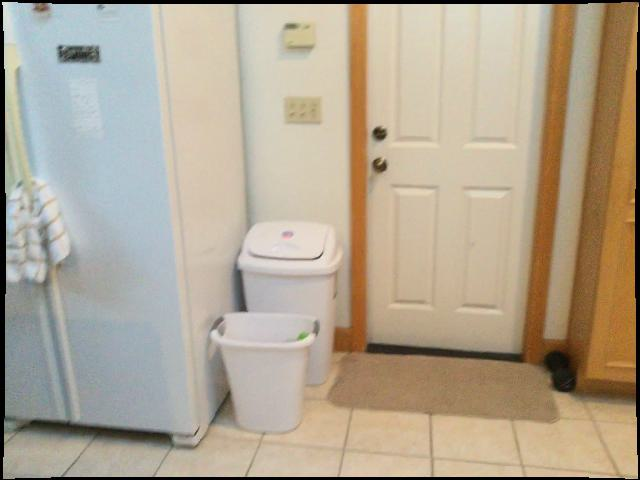
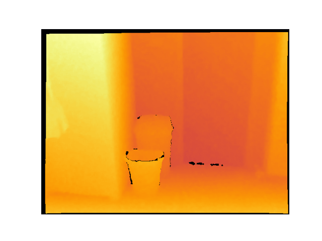
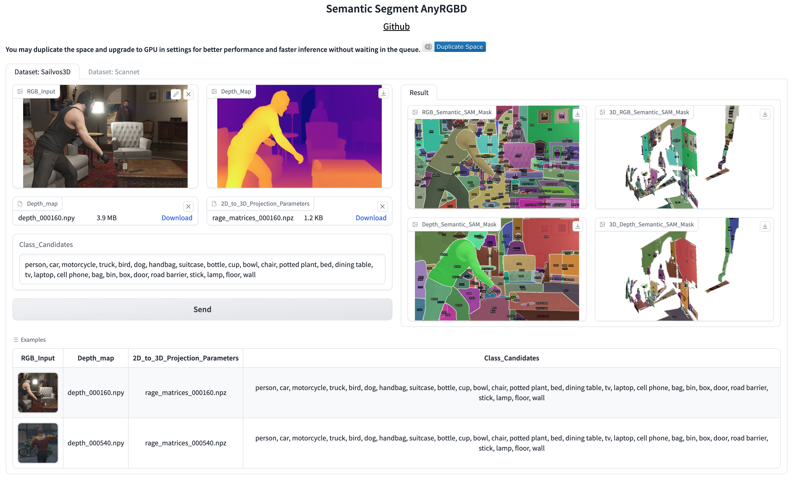

<p align="center">

</p>  

# SAD: Segment Any RGBD
- Authors: [Jun Cen](https://cen-jun.com), [Yizheng Wu](https://scholar.google.com/citations?user=0_iF4jMAAAAJ&hl=zh-CN), [Xingyi Li](https://scholar.google.com/citations?user=XDKQsvUAAAAJ&hl=zh-CN), [Jingkang Yang](https://jingkang50.github.io/), [Yixuan Pei](https://github.com/peiyixuan), [Lingdong Kong](https://ldkong.com/)
- Institutes: [Visual Intelligence Lab@HKUST](https://cqf.io/lab.html), [HUST](http://english.hust.edu.cn/), [MMLab@NTU](https://www.mmlab-ntu.com/), [Smiles Lab@XJTU](http://www.smiles-xjtu.com/), [NUS](https://nus.edu.sg/)

🎉🎉🎉 Welcome to the Segment Any RGBD GitHub repository! 🎉🎉🎉  
***
🤗🤗🤗 Segment AnyRGBD is a toolbox to segment **rendered depth images** based on SAM! Don't forget to star this repo if you find it interesting!  
[](https://huggingface.co/spaces/jcenaa/Semantic_Segment_AnyRGBD)
[](https://huggingface.co/spaces/mmlab-ntu/Segment-Any-RGBD)

| Input to SAM (RGB or Rendered Depth Image) |  SAM Masks with Class and Semantic Masks| 3D Visualization for SAM Masks with Class and Semantic Masks|
| :---: | :---:| :---:|
|  | | |
|  | | |


## 🥳 Introduction
We find that humans can naturally identify objects from the visulization of the depth map, so we first map the depth map ([H, W]) to the RGB space ([H, W, 3]) by a [colormap](https://matplotlib.org/stable/tutorials/colors/colormaps.html#lightness-of-matplotlib-colormaps) function, and then feed the **rendered depth image** into SAM. Compared to the RGB image, the rendered depth image ignores the texture information and focuses on the **geometry** information. The input images to SAM are all **RGB** images in SAM-based projects like [SSA](https://github.com/fudan-zvg/Semantic-Segment-Anything), [Anything-3D](https://github.com/Anything-of-anything/Anything-3D), and [SAM 3D](https://github.com/Pointcept/SegmentAnything3D). We are the first to use SAM to extract the geometry information directly. The following figures show that depth maps with different colormap functions has different SAM results.
<p align="center">

</p>

## 😎 Method

In this repo, we provide two alternatives for the users, including feeding the RGB images or rendered depth images to the SAM. In each mode, the user could obtain the semantic masks (one color refers to one class) and the SAM masks with the class. The overall structure is shown in the following figure. We use [OVSeg](https://github.com/facebookresearch/ov-seg) for zero-shot semantic segmentation.

<p align="center">

</p>

## 🤩 Comparison

- RGB images mainly represents the texture information and depth images contains the geometry information, so the RGB images are more colorful than the rendered depth image.  In this case, SAM provides much more masks for RGB inputs than depth inputs, as shown in the following figure.
- The rendered depth image alleviates the over-segment results of SAM. For example, the table is segmented as four parts on the RGB images, and one of them is classified as the chair in the semantic results (yellow circles in the following figure). In contrast, the table is regarded as a whole object on the depth image and correctly-classified. A part of the head of a human is classified as the wall on the RGB image (blue circles in the following figure), but it is well classified on the depth image.
- Two objects which are very close may be segmented as one object on the depth image, such as the chair in the red circle. In this case, texture information in the RGB images are essential to find out the object.

<p align="center">

</p>

## 🔥 Demos
### Sailvos3D Dataset
| Input to SAM (RGB or Rendered Depth Image) |  SAM Masks with Class and Semantic Masks| 3D Visualization for SAM Masks with Class and Semantic Masks|
| :---: | :---:| :---:|
|  | | |
|  | | |
|  | | |
|  | | |

### ScannetV2 Dataset
| Input to SAM (RGB or Rendered Depth Image) |  SAM Masks with Class and Semantic Masks| 3D Visualization for SAM Masks with Class and Semantic Masks|
| :---: | :---:| :---:|
|  | | |
|  | | |
|  | | |
|  | | |

## ⚙️ Installation    

Please see [installation guide](./INSTALL.md).

## 💫 Try Demo
### 🤗 Try Demo on Huggingface
[](https://huggingface.co/spaces/jcenaa/Semantic_Segment_AnyRGBD)
[](https://huggingface.co/spaces/mmlab-ntu/Segment-Any-RGBD)

### 🤗 Try Demo Locally
We provide the UI (`ui.py`) and example inputs (`/UI/`) to reproduce the above demos. We use the OVSeg checkpoints [ovseg_swinbase_vitL14_ft_mpt.pth](https://drive.google.com/file/d/1cn-ohxgXDrDfkzC1QdO-fi8IjbjXmgKy/view?usp=sharing) for zero-shot semantic segmentation, and SAM checkpoints [sam_vit_h_4b8939.pth](https://dl.fbaipublicfiles.com/segment_anything/sam_vit_h_4b8939.pth). Put them under this repo. Simply try our UI on your own computer:
```bash
python ui.py 
```
Simply click one of the Examples at the bottom and the input examples will be automatically fill in. Then simply click 'Send' to generate and visualize the results. The inference takes around 2 and 3 minutes for ScanNet and SAIL-VOS 3D respectively.
<p align="center">

</p>


## Data Preparation

Please download [SAIL-VOS 3D](https://sailvos.web.illinois.edu/_site/_site/index.html#home) and [ScanNet](http://www.scan-net.org/) to try more demos.


## LICENSE

Shield: [![CC BY-NC 4.0][cc-by-nc-shield]][cc-by-nc]

This repo is developed based on [OVSeg](https://github.com/facebookresearch/ov-seg) which is licensed under a
[Creative Commons Attribution-NonCommercial 4.0 International License](LICENSE).

[![CC BY-NC 4.0][cc-by-nc-image]][cc-by-nc]

[cc-by-nc]: http://creativecommons.org/licenses/by-nc/4.0/
[cc-by-nc-image]: https://licensebuttons.net/l/by-nc/4.0/88x31.png
[cc-by-nc-shield]: https://img.shields.io/badge/License-CC%20BY--NC%204.0-lightgrey.svg

However portions of the project are under separate license terms: CLIP and ZSSEG are licensed under the [MIT license](https://github.com/openai/CLIP/blob/main/LICENSE); MaskFormer is licensed under the [CC-BY-NC](https://github.com/facebookresearch/MaskFormer/blob/main/LICENSE); openclip is licensed under the license at [its repo](https://github.com/mlfoundations/open_clip/blob/main/LICENSE); SAM is licensed under the [Apache License](https://github.com/facebookresearch/segment-anything/blob/main/LICENSE).

