<p align="center">
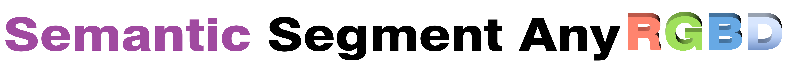
</p>  

- Authors: [Jun Cen](www.cen-jun.com), [Yizheng Wu](https://scholar.google.com/citations?user=0_iF4jMAAAAJ&hl=zh-CN), [Xingyi Li](https://scholar.google.com/citations?user=XDKQsvUAAAAJ&hl=zh-CN), [Jingkang Yang](https://jingkang50.github.io/), [Yixuan Pei](https://github.com/peiyixuan), [LingDong Kong](https://ldkong.com/)
- Institutes: The Hong Kong University of Science and Technology, Huazhong University of Science and Technology, Nanyang Technological University, Xi'an Jiaotong University, National University of Singapore

***
[SAM](https://github.com/facebookresearch/segment-anything) is a very powerful segmentation model. [SSA](https://github.com/fudan-zvg/Semantic-Segment-Anything) extends the SAM with the semantic segmentation ability. [Anything-3D](https://github.com/Anything-of-anything/Anything-3D) uses SAM to obtain the object mask for object-level 3D generation, and [SAM 3D](https://github.com/Pointcept/SegmentAnything3D) segments multiple 2D frames for 3D scene segmentation.  The input images to SAM are all **RGB** images in [SSA](https://github.com/fudan-zvg/Semantic-Segment-Anything), [Anything-3D](https://github.com/Anything-of-anything/Anything-3D), and [SAM 3D](https://github.com/Pointcept/SegmentAnything3D). We find that humans can naturally identify objects from the visulization of the depth map, so we first map the depth map ([H, W]) to the RGB space ([H, W, 3]) by a [colormap](https://matplotlib.org/stable/tutorials/colors/colormaps.html#lightness-of-matplotlib-colormaps) function, and then feed the **rendered depth image** into SAM. Compared to the RGB image, the rendered depth image ignores the texture information and focuses on the **geometry** information. The following figures show that the SAM segments the table into 4 parts based on the RGB image, but segments the table as a whole object when inputs are rendered depth images.
<p align="center">

</p>

In this repo, we provide two alternatives for the users, including feeding the RGB images or rendered depth images to the SAM. In each mode, the user could obtain the semantic masks (one color refers to one class) and the SAM masks with the class. The overall structure is shown in the following figure.

<p align="center">
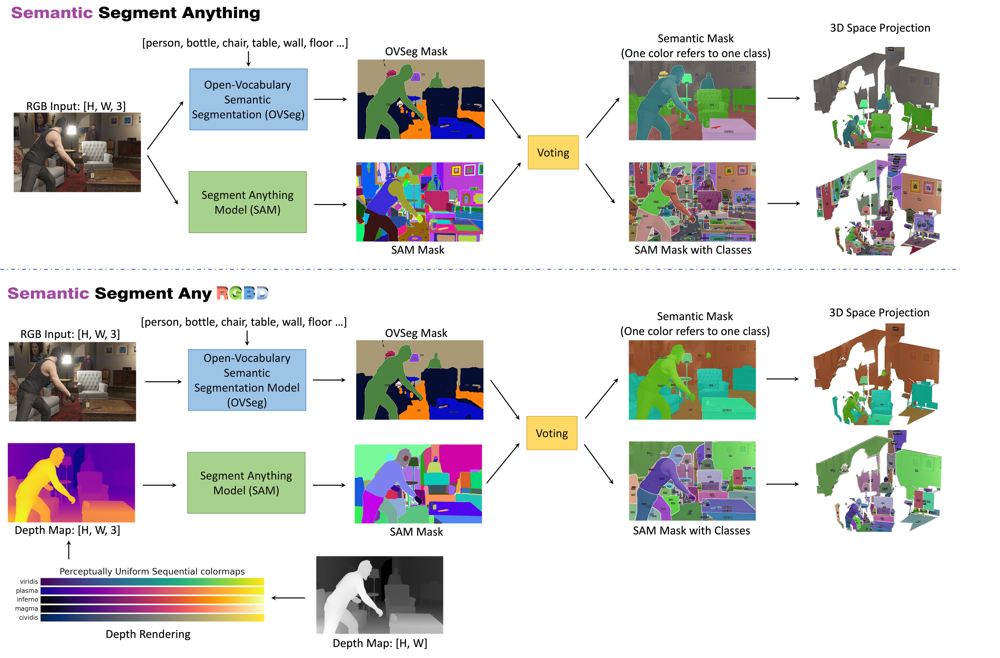
</p>

## Demos
### Sailvos3D Dataset
| Input (RGB or Rendered Depth Image) | SAM Masks with Class| 3D Visualization |
| :---: | :---:| :---:|
|  | 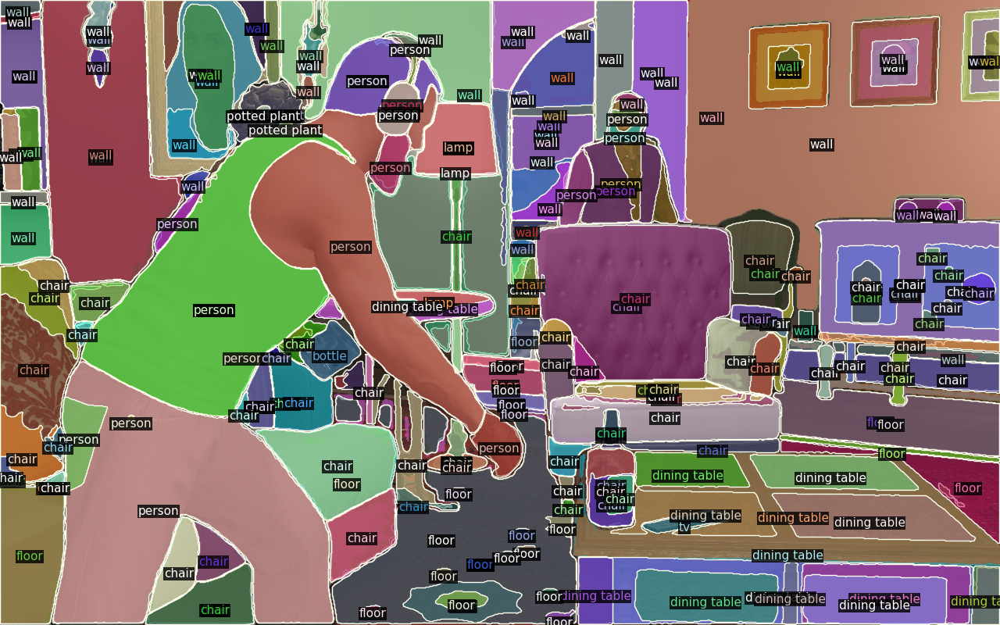| |
|  | 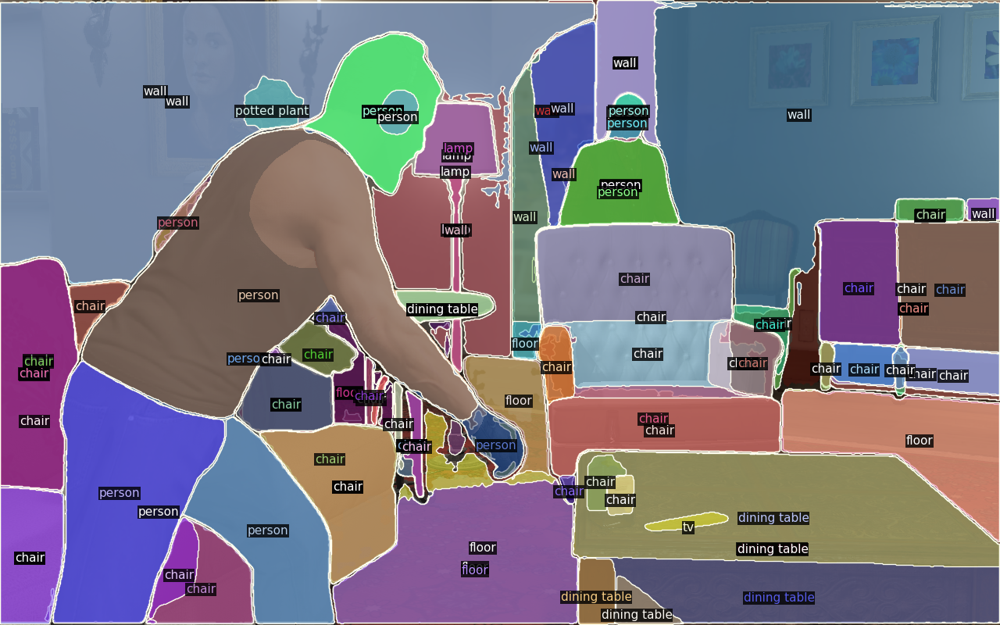| |
|  | 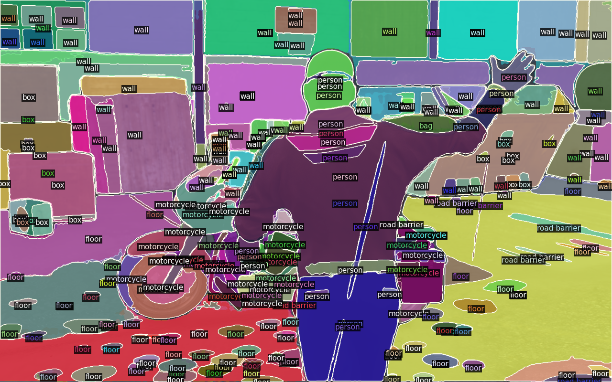| |
| 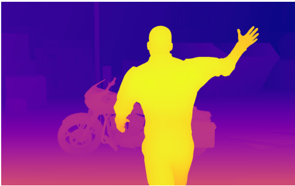 | 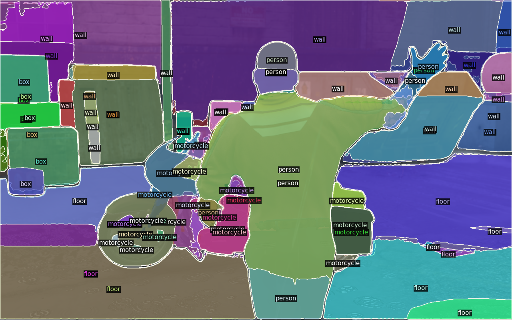| |

### ScannetV2 Dataset
| Input (RGB or Rendered Depth Image) | SAM Masks with Class| 3D Visualization |
| :---: | :---:| :---:|
|  | 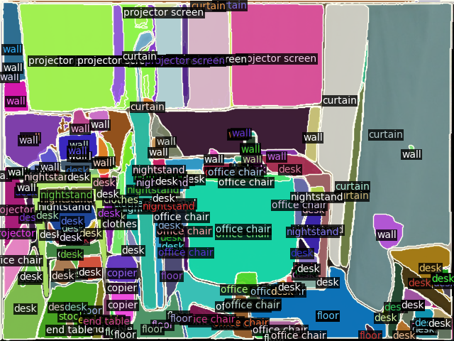| |
|  | 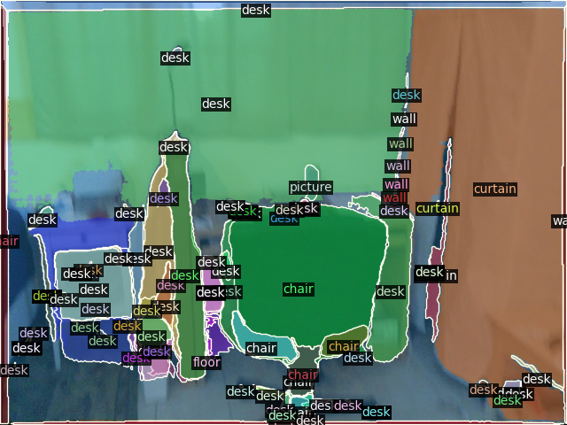| |
|  | 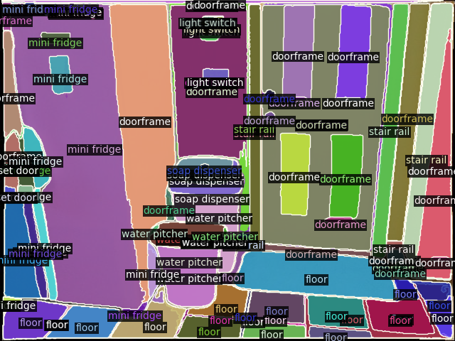| |
|  | 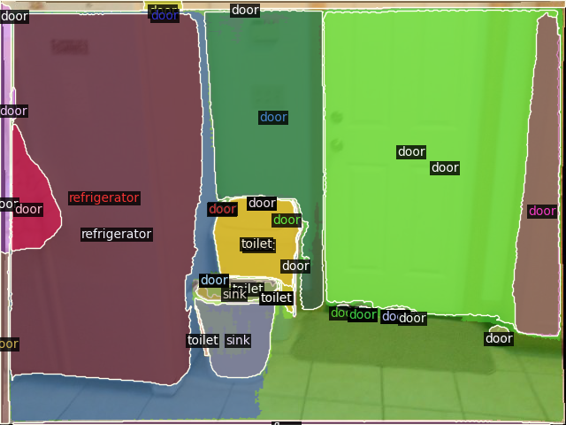| |
## Installation    

Please see [installation guide](./INSTALL.md).

## Data Preparation

Please see [datasets preparation](./datasets/DATASETS.md).

## Getting started

Please see [getting started instruction](./GETTING_STARTED.md).

## LICENSE

Shield: [![CC BY-NC 4.0][cc-by-nc-shield]][cc-by-nc]

The majority of OVSeg is licensed under a
[Creative Commons Attribution-NonCommercial 4.0 International License](LICENSE).

[![CC BY-NC 4.0][cc-by-nc-image]][cc-by-nc]

[cc-by-nc]: http://creativecommons.org/licenses/by-nc/4.0/
[cc-by-nc-image]: https://licensebuttons.net/l/by-nc/4.0/88x31.png
[cc-by-nc-shield]: https://img.shields.io/badge/License-CC%20BY--NC%204.0-lightgrey.svg

However portions of the project are under separate license terms: CLIP and ZSSEG are licensed under the [MIT license](https://github.com/openai/CLIP/blob/main/LICENSE); MaskFormer is licensed under the [CC-BY-NC](https://github.com/facebookresearch/MaskFormer/blob/main/LICENSE); openclip is licensed under the license at [its repo](https://github.com/mlfoundations/open_clip/blob/main/LICENSE).


## Citing OVSeg :pray:

If you use OVSeg in your research or wish to refer to the baseline results published in the paper, please use the following BibTeX entry.

```BibTeX
@article{liang2022open,
  title={Open-Vocabulary Semantic Segmentation with Mask-adapted CLIP},
  author={Liang, Feng and Wu, Bichen and Dai, Xiaoliang and Li, Kunpeng and Zhao, Yinan and Zhang, Hang and Zhang, Peizhao and Vajda, Peter and Marculescu, Diana},
  journal={arXiv preprint arXiv:2210.04150},
  year={2022}
}
```
